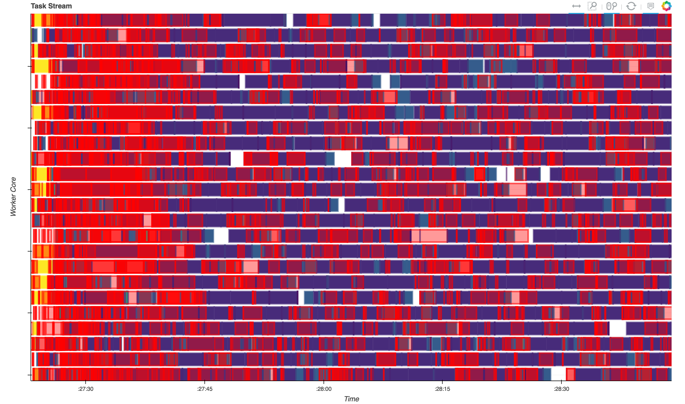

Title: Introducing Dask-SearchCV
Date: 2017-04-04 15:00
Category: dask
Tags: dask
Slug: introducing-dask-searchcv
Author: Jim Crist
Summary: A new library for distributed hyperparameter optimization

## Summary

We introduce [a new library](http://dask-searchcv.readthedocs.io) for doing
distributed hyperparameter optimization with Scikit-Learn estimators. We
compare it to the existing Scikit-Learn implementations, and discuss when it
may be useful compared to other approaches.

## Introduction

Last summer I spent some time experimenting with combining
[dask](http://dask.pydata.org/en/latest/) and
[scikit-learn](http://scikit-learn.org/stable/) (chronicled in this
[series]({filename}/dask_learn_part_1.md) [of
blog]({filename}/dask_learn_part_2.md)
[posts]({filename}/dask_learn_part_3.md)). The library that work produced was
extremely alpha, and nothing really came out of it. Recently I picked this work
up again, and am happy to say that we now have something I can be happy with.
This involved a few major changes:

- A sharp reduction in scope. The previous rendition tried to implement both
  *model* and *data* parallelism. Not being a machine-learning expert, the data
  parallelism was implemented in a less-than-rigorous manner. The scope is now
  pared back to just implementing hyperparameter searches (model parallelism),
  which is something we can do well.

- Optimized graph building. Turns out when people are given the option to run
  grid search across a cluster, they immediately want to scale up the grid
  size. At the cost of more complicated code, we can handle extremely large
  grids (e.g. 500,000 candidates now takes seconds for the graph to build, as
  opposed to minutes before). *It should be noted that for grids this size, an
  active search may perform significantly better*. Relevant issue:
  [#29](https://github.com/dask/dask-searchcv/issues/29).

- Increased compatibility with Scikit-Learn. Now with only a few exceptions,
  the implementations of `GridSearchCV` and `RandomizedSearchCV` should be
  drop-ins for their scikit-learn counterparts.

All these changes have led to a name change (previously was `dask-learn`). The
new library is [`dask-searchcv`](http://dask-searchcv.readthedocs.io). It can
be installed via conda or pip:

    ::
    # conda
    $ conda install dask-searchcv -c conda-forge
    # pip
    $ pip install dask-searchcv

In this post I'll give a brief overview of the library, and touch on when you
might want to use it over other options.

## What's a grid search?

Many machine learning algorithms have *hyperparameters* which can be tuned to
improve the performance of the resulting estimator. A [grid
search](https://en.wikipedia.org/wiki/Hyperparameter_optimization#Grid_search)
is one way of optimizing these parameters &mdash; it works by doing a parameter
sweep across a cartesian product of a subset of these parameters (the "grid"),
and then choosing the best resulting estimator. Since this is fitting many
independent estimators across the same set of data, it can be fairly easily
parallelized.

## Example using Text Classification

We'll be reproducing [this
example](http://scikit-learn.org/stable/auto_examples/model_selection/grid_search_text_feature_extraction.html).
using the newsgroups dataset from the scikit-learn docs.

### Setup

First we need to load the data:

    ::Python
    from sklearn.datasets import fetch_20newsgroups

    categories = ['alt.atheism', 'talk.religion.misc']
    data = fetch_20newsgroups(subset='train', categories=categories)
    print("Number of samples: %d" % len(data.data))

    Number of samples: 857

Next, we'll build a pipeline to do the feature extraction and classification.
This is composed of a
[CountVectorizer](http://scikit-learn.org/stable/modules/generated/sklearn.feature_extraction.text.CountVectorizer.html),
a [TfidfTransformer](http://scikit-learn.org/stable/modules/generated/sklearn.feature_extraction.text.TfidfTransformer.html),
and a [SGDClassifier](http://scikit-learn.org/stable/modules/generated/sklearn.linear_model.SGDClassifier.html).

    ::Python
    from sklearn.feature_extraction.text import CountVectorizer
    from sklearn.feature_extraction.text import TfidfTransformer
    from sklearn.linear_model import SGDClassifier
    from sklearn.pipeline import Pipeline

    pipeline = Pipeline([('vect', CountVectorizer()),
                         ('tfidf', TfidfTransformer()),
                         ('clf', SGDClassifier())])

All of these take several parameters. We'll only do a grid search across a few
of them:

    ::Python
    # Parameters of steps are set using '__' separated parameter names:
    parameters = {'vect__max_df': (0.5, 0.75, 1.0),
                  'vect__ngram_range': ((1, 1), (1, 2)),
                  'tfidf__use_idf': (True, False),
                  'tfidf__norm': ('l1', 'l2'),
                  'clf__alpha': (1e-2, 1e-3, 1e-4, 1e-5),
                  'clf__n_iter': (10, 50, 80),
                  'clf__penalty': ('l2', 'elasticnet')}

    from sklearn.model_selection import ParameterGrid
    print("Number of candidates: %d" % len(ParameterGrid(parameters)))

    Number of candidates: 576

### Fitting with Scikit-Learn

In Scikit-Learn, a grid search is performed using the `GridSearchCV` class, and
can (optionally) be automatically parallelized using
[joblib](https://pythonhosted.org/joblib/index.html). Here we'll parallelize
across 8 processes (the number of cores on my machine).

    ::Python
    from sklearn.model_selection import GridSearchCV

    grid_search = GridSearchCV(pipeline, parameters, n_jobs=8)

    %time grid_search.fit(data.data, data.target)

    CPU times: user 39.1 s, sys: 12.7 s, total: 51.8 s
    Wall time: 9min 12s

### Fitting with Dask-SearchCV

The implementation of `GridSearchCV` in Dask-SearchCV is (almost) a drop-in
replacement for the Scikit-Learn version. A few lesser used parameters aren't
implemented, and there are a few new parameters as well. One of these is the
`scheduler` parameter for specifying which dask
[scheduler](http://dask.pydata.org/en/latest/scheduler-choice.html#choosing-between-schedulers)
to use. By default, if the global scheduler is set then it is used, and if the
global scheduler is not set then the threaded scheduler is used.

In this case, we'll use the distributed scheduler setup locally with 8
processes, each with a single thread. We choose this setup because:

- We're working with python strings instead of numpy arrays, which means that
  the GIL is held for some of the tasks. This means we at least want to use a
  couple processes to get true parallelism (which excludes the threaded
  scheduler).

- For most graphs, the distributed scheduler will be more efficient than the
  multiprocessing scheduler, as it can be smarter about moving data between
  workers. Since a distributed scheduler is easy to setup locally (just create
  a `dask.distributed.Client()`) there's not really a downside to using it when
  you want multiple processes.

Note the changes between using Scikit-Learn and Dask-SearchCV here are quite
small:

    ::Python
    from dask.distributed import Client
    # Create a local cluster, and set as the default scheduler
    client = Client()
    client

    <Client: scheduler='tcp://127.0.0.1:64485' processes=8 cores=8>

    ::Python
    import dask_searchcv as dcv

    # Only difference here is absence of `n_jobs` parameter
    dgrid_search = dcv.GridSearchCV(pipeline, parameters)

    %time dgrid_search.fit(data.data, data.target)

    CPU times: user 36.9 s, sys: 9.75 s, total: 46.7 s
    Wall time: 7min 16s

## Why is the dask version faster?

If you look at the times above, you'll note that the dask version was `~1.3X`
faster than the scikit-learn version. This is not because we have optimized any
of the pieces of the `Pipeline`, or that there's a significant amount of
overhead to `joblib`. The reason is simply that the dask version is doing less
work.

Given a smaller grid

    ::Python
    parameters = {'vect__ngram_range': [(1, 1)],
                  'tfidf__norm': ['l1', 'l2'],
                  'clf__alpha': [1e-3, 1e-4, 1e-5]}

and the same pipeline as above, the Scikit-Learn version looks something like
(simplified):

    ::Python
    scores = []
    for ngram_range in parameters['vect__ngram_range']:
        for norm in parameters['tfidf__norm']:
            for alpha in parameters['clf__alpha']:
                vect = CountVectorizer(ngram_range=ngram_range)
                X2 = vect.fit_transform(X, y)
                tfidf = TfidfTransformer(norm=norm)
                X3 = tfidf.fit_transform(X2, y)
                clf = SGDClassifier(alpha=alpha)
                clf.fit(X3, y)
                scores.append(clf.score(X3, y))
    best = choose_best_parameters(scores, parameters)

As a directed acyclic graph, this might look like:

In contrast, the dask version looks more like:

    ::Python
    scores = []
    for ngram_range in parameters['vect__ngram_range']:
        vect = CountVectorizer(ngram_range=ngram_range)
        X2 = vect.fit_transform(X, y)
        for norm in parameters['tfidf__norm']:
            tfidf = TfidfTransformer(norm=norm)
            X3 = tfidf.fit_transform(X2, y)
            for alpha in parameters['clf__alpha']:
                clf = SGDClassifier(alpha=alpha)
                clf.fit(X3, y)
                scores.append(clf.score(X3, y))
    best = choose_best_parameters(scores, parameters)

As a directed acyclic graph, this might look like:

Looking closely, you can see that the Scikit-Learn version ends up fitting
earlier steps in the pipeline multiple times with the same parameters and data.
Due to the increased flexibility of Dask over Joblib, we're able to merge these
tasks in the graph and only perform the fit step once for any
parameter/data/estimator combination. For pipelines that have relatively
expensive early steps, this can be a big win when performing a grid search.

## Distributed Grid Search

Since Dask decouples the scheduler from the graph specification, we can easily
switch from running on a single machine to running on a cluster
with a quick change in scheduler. Here I've setup a cluster of 3
[m4.2xlarge](https://aws.amazon.com/ec2/pricing/on-demand/) instances for the
workers (each with 8 single-threaded processes), and another instance for the
scheduler. This was easy to do with a single command using the
[`dask-ec2`](https://github.com/dask/dask-ec2) utility:

    ::
    $ dask-ec2 up --keyname mykey --keypair ~/.ssh/mykey.pem --nprocs 8 --type m4.2xlarge

To switch to using the cluster instead of running locally, we just instantiate
a new client, and then rerun:

    ::Python
    client = Client('54.146.59.240:8786')
    client

    <Client: scheduler='tcp://54.146.59.240:8786' processes=24 cores=24>

    ::Python
    %time dgrid_search.fit(data.data, data.target)

    CPU times: user 871 ms, sys: 23.3 ms, total: 894 ms
    Wall time: 2min 43s

Roughly a 3x speedup, which is what we'd expect given 3x more workers. By just
switching out schedulers we were able to scale our grid search out across
multiple workers for increased performance.

Below you can see the [diagnostic
plot](http://distributed.readthedocs.io/en/latest/web.html) for this run. These
show the operations that each of 24 workers were doing over time. We can see
that we're keeping the cluster fairly well saturated with work (blue) and not
idle time (white). There's a fair bit of serialization (red), but the values
being serialized are small, so this is relatively cheap to do. Note that this
plot is also a bit misleading, as the red boxes are drawn on top of the running
tasks, making it look worse than it really is.

## Distributed Grid Search with Joblib

For comparison, we'll also run the Scikit-Learn grid search using joblib with
the [`dask.distributed`](http://distributed.readthedocs.io/en/latest/joblib.html)
backend. This is also only a few lines changed:

    ::Python
    # Need to import the backend to register it
    import distributed.joblib
    from sklearn.externals.joblib import parallel_backend

    # Use the dask.distributed backend with our current cluster
    with parallel_backend('dask.distributed', '54.146.59.240:8786'):
        %time grid_search.fit(data.data, data.target)

    CPU times: user 12.1 s, sys: 3.26 s, total: 15.3 s
    Wall time: 3min 32s

## Analysis

In this post we performed 4 different grid searches over a pipeline:

<pre>
|    Library     |   Backend    | Cores |   Time   |
+----------------+--------------+-------+----------+
| Scikit-Learn   |  local       |  8    | 9min 12s |
| Dask-SearchCV  |  local       |  8    | 7min 16s |
| Scikit-Learn   |  distributed |  24   | 3min 32s |
| Dask-SearchCV  |  distributed |  24   | 2min 43s |
</pre>

Looking at these numbers we can see that both the Scikit-Learn and
Dask-SearchCV implementations scale as more cores are added. However, the
Dask-SearchCV implementation is faster in both cases because it's able to merge
redundant calls to `fit` and can avoid unnecessary work. For this simple
pipeline this saves only a minute or two, but for more expensive
transformations or larger grids the savings may be substantial.

## When is this useful?

- For single estimators (no `Pipeline` or `FeatureUnion`) Dask-SearchCV
  performs only a small constant factor faster than using Scikit-Learn with the
  `dask.distributed` backend. The benefits of using Dask-SearchCV in these
  cases will be minimal.

- If the model contains meta estimators (`Pipeline` or `FeatureUnion`) then you
  may start seeing performance benefits, especially if early steps in the
  pipeline are relatively expensive.

- If the data your're fitting on is already on a cluster, then Dask-SearchCV
  will (currently) be more efficient, as it works nicely with remote data. You
  can pass dask arrays, dataframes or delayed objects to `fit`, and everything
  will work fine without having to bring the data back locally.

- If your data is too large for Scikit-Learn to work nicely, then this library
  won't help you. This is just for scheduling Scikit-Learn estimator fits in an
  intelligent way on small-medium data. It doesn't reimplement any of the
  algorithms found in Scikit-Learn to scale to larger datasets.

## Future work

Currently we just mirror the Scikit-Learn classes `GridSearchCV` and
`RandomizedSearchCV` for doing passive searches through a parameter space.
While we [can handle very large
grids](https://github.com/dask/dask-searchcv/issues/29) at some point switching
to an active search method might be best. Something like this could be built up
using the asynchronous methods in `dask.distributed`, and I think would be fun
to work on. If you have knowledge in this domain, please weigh in on the
[related issue](https://github.com/dask/dask-searchcv/issues/32).

---

*This work is supported by [Continuum Analytics](http://continuum.io/), [the
XDATA program](http://www.darpa.mil/program/XDATA), and the Data Driven
Discovery Initiative from the [Moore Foundation](https://www.moore.org/).
Thanks also to [Matthew Rocklin](http://matthewrocklin.com/blog/) and [Will
Warner](https://github.com/electronwill) for feedback on drafts of this post.*
